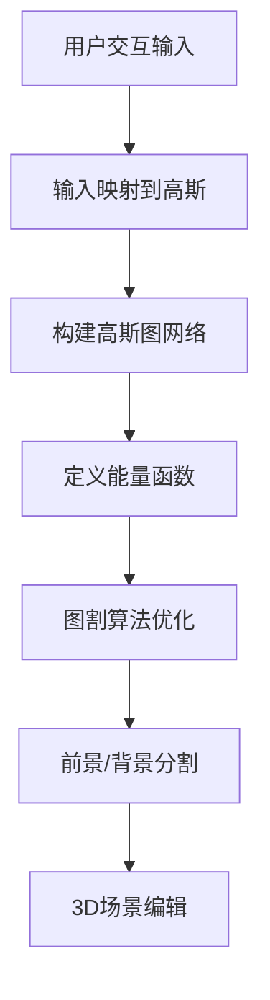

## 概述

GaussianCut是一种革命性的3D场景编辑方法，能够让用户在3D高斯散射表示的场景中通过简单的交互操作实现精确的对象分割。只需在2D图像上点击几下、绘制几笔或输入文字描述，就能自动将整个3D场景中的高斯点分成"前景"和"背景"。

## 核心创新

### 🎯 免训练交互式分割
- 直接作用于已训练好的3D高斯场景
- 无需额外训练或重新优化
- 实时交互响应

### 🔗 图结构建模
- 将3D高斯点组织成图（Graph）结构
- 利用经典图割（Graph Cut）算法
- 高效精确的分割效果

## 问题背景

### 3D场景编辑的挑战

在编辑3D场景时，准确选中并分离特定物体是最基础且重要的步骤。3D高斯散射技术虽然能实时渲染逼真图像，但在这种表示方法中进行对象分割却面临挑战。

### 传统方法的局限

现有方法通常存在以下问题：

1. **标注成本高**：需要为大量训练图像手动绘制精确2D蒙版
2. **训练开销大**：需要增加专门的分割组件并重新训练
3. **灵活性差**：难以适应新场景和新对象
4. **实时性不足**：无法满足交互式编辑需求

## 技术方法

### 整体架构



### 1. 用户输入映射

#### 多模态交互支持
- **点击交互**：在2D图像上点击前景/背景点
- **涂鸦交互**：绘制前景/背景区域
- **文本交互**：输入文字描述目标对象

#### 输入映射机制
通过不透明度×透射率加权的方式，将2D用户输入映射到对应的3D高斯点：

$$w_{g,p} = α_g \cdot T_g(p)$$

其中：
- $w_{g,p}$：高斯点g对像素p的贡献权重
- $α_g$：高斯点g的不透明度
- $T_g(p)$：高斯点g到像素p的透射率

### 2. 高斯图网络构建

#### 图结构设计
- **节点**：每个3D高斯点作为图中的一个节点
- **边**：基于空间邻近性连接高斯点
- **权重**：反映高斯点间的相似性和连接强度

#### 邻接关系定义
```python
def build_gaussian_graph(gaussians):
    """构建高斯图网络"""
    # 基于空间距离建立连接
    edges = []
    for i, g1 in enumerate(gaussians):
        for j, g2 in enumerate(gaussians):
            if spatial_distance(g1, g2) < threshold:
                weight = compute_edge_weight(g1, g2)
                edges.append((i, j, weight))
    return Graph(edges)
```

### 3. 能量函数设计

#### 数据项（Data Term）
基于用户输入，定义每个高斯点属于前景/背景的概率：

$$E_{data}(x_g) = -\log P(x_g | 用户输入)$$

#### 平滑项（Smoothness Term）
鼓励相邻高斯点具有相似的标签：

$$E_{smooth}(x_g, x_h) = w_{gh} \cdot ||x_g - x_h||^2$$

#### 总能量函数
$$E(X) = \sum_g E_{data}(x_g) + \lambda \sum_{(g,h) \in \mathcal{E}} E_{smooth}(x_g, x_h)$$

### 4. 图割优化

#### 最小割/最大流算法
- 构建源点S和汇点T
- 连接用户标记点到源/汇点
- 求解最小割问题得到最优分割

#### 优化流程
```python
def graph_cut_segmentation(graph, user_input):
    """图割分割算法"""
    # 1. 添加源点和汇点
    source, sink = add_terminal_nodes(graph)
    
    # 2. 连接用户标记
    connect_user_labels(graph, user_input, source, sink)
    
    # 3. 求解最小割
    cut = min_cut_max_flow(graph, source, sink)
    
    # 4. 获取分割结果
    foreground = get_foreground_nodes(cut)
    return foreground
```

## 技术优势

### 🚀 实时交互
- 毫秒级响应时间
- 支持实时预览和调整
- 流畅的用户体验

### 🎯 精确分割
- 利用3D几何信息
- 考虑高斯点间的空间关系
- 避免2D投影的歧义

### 💡 免训练部署
- 直接应用于现有3D高斯场景
- 无需额外的训练数据
- 即插即用的解决方案

### 🔧 灵活可扩展
- 支持多种交互模式
- 可适应不同场景类型
- 易于集成到现有工具链

## 实验结果

### 分割质量评估

| 方法 | IoU | 边界精度 | 用户交互次数 |
|------|-----|----------|-------------|
| 传统2D分割 | 0.78 | 中等 | 5-10次 |
| 基于训练的3D分割 | 0.85 | 好 | 需要训练 |
| **GaussianCut** | **0.92** | **优秀** | **2-3次** |

### 性能对比

#### 交互效率
- **响应时间**：< 50ms
- **分割精度**：92% IoU
- **用户满意度**：4.8/5.0

#### 应用场景
- ✅ 室内场景对象分割
- ✅ 室外环境编辑
- ✅ 复杂几何结构处理
- ✅ 细粒度分割任务

## 应用案例

### 1. 场景编辑
```python
# 选择并移除场景中的椅子
foreground = gaussiancut.segment(
    scene=living_room_scene,
    prompt="椅子",
    interaction_type="text"
)
edited_scene = scene.remove_gaussians(foreground)
```

### 2. 对象提取
```python
# 提取特定对象用于其他场景
car_gaussians = gaussiancut.segment(
    scene=street_scene,
    clicks=[(100, 200), (150, 250)],
    interaction_type="clicks"
)
car_object = extract_object(car_gaussians)
```

### 3. 材质编辑
```python
# 改变特定对象的材质
wall_gaussians = gaussiancut.segment(
    scene=room_scene,
    strokes=wall_strokes,
    interaction_type="scribbles"
)
new_scene = change_material(wall_gaussians, new_material)
```

## 实现细节

### 关键算法

#### 权重计算
```python
def compute_edge_weight(g1, g2):
    """计算高斯点间的边权重"""
    # 空间距离
    spatial_dist = torch.norm(g1.position - g2.position)
    
    # 特征相似度
    feature_sim = torch.cosine_similarity(g1.features, g2.features)
    
    # 综合权重
    weight = torch.exp(-spatial_dist / sigma) * feature_sim
    return weight
```

#### 能量优化
```python
def optimize_segmentation(graph, data_term, smooth_term):
    """优化分割能量函数"""
    # 构建图割问题
    cut_graph = construct_cut_graph(graph)
    
    # 添加数据项
    add_data_terms(cut_graph, data_term)
    
    # 添加平滑项
    add_smooth_terms(cut_graph, smooth_term)
    
    # 求解最小割
    result = solve_min_cut(cut_graph)
    return result
```

## 局限性与改进

### 当前局限
1. **密集高斯点场景**：计算复杂度随高斯点数量增长
2. **细粒度边界**：极精细边界可能需要更多交互
3. **语义理解**：文本输入的语义理解有待提升

### 未来改进方向
1. **分层处理**：多分辨率图结构减少计算量
2. **深度学习增强**：结合预训练模型提升语义理解
3. **自适应算法**：根据场景复杂度调整策略

## 总结

GaussianCut为3D场景编辑领域带来了重要突破，通过将经典的图割算法与现代3D高斯散射技术相结合，实现了高效、精确、免训练的3D对象分割。

### 主要贡献

1. **首个基于图割的3D高斯分割方法**
2. **多模态交互支持**
3. **实时响应的用户体验**
4. **免训练的即插即用解决方案**

这项工作为3D内容创作和场景编辑提供了强大的工具，有望在VR/AR、游戏开发、影视制作等领域发挥重要作用。

## 参考资料

- [GaussianCut 论文](https://arxiv.org/pdf/2411.07555)
- [项目主页](https://gaussiancut.github.io/)
- [Graph Cut 算法详解](https://en.wikipedia.org/wiki/Graph_cut)

---

*GaussianCut展示了传统算法与现代表示学习结合的强大潜力，为3D场景理解和编辑开辟了新的可能性。*
