## 什么是3D Gaussian Splatting？

3D Gaussian Splatting (3DGS) 是一种革命性的3D场景表示和渲染技术，由Inria团队在2023年提出。它使用3D高斯椭球来表示场景，能够实现实时、高质量的新视角合成。

## 核心优势

### 🚀 实时渲染
- 相比NeRF的分钟级渲染，3DGS可以达到实时渲染效果
- 在GTX 1080上就能达到30+ FPS

### 🎯 高质量输出
- 渲染质量与NeRF相当甚至更好
- 细节保留更加完整

### ⚡ 快速训练
- 训练时间从NeRF的数小时缩短到30分钟内
- 显存占用更少

## 技术原理

### 高斯表示

每个3D高斯由以下参数定义：

$$G(x) = e^{-\frac{1}{2}(x-\mu)^T\Sigma^{-1}(x-\mu)}$$

其中：
- $\mu$ : 高斯中心位置
- $\Sigma$ : 协方差矩阵（控制形状和方向）

### 渲染流程

```mermaid
graph LR
    A[输入图像] --> B[特征提取]
    B --> C[高斯初始化]
    C --> D[可微分栅格化]
    D --> E[渲染图像]
    E --> F[损失计算]
    F --> G[梯度反传]
    G --> C
```



## 应用场景

### 🎮 游戏开发
- 实时场景渲染
- 动态光照效果

### 🎬 影视制作
- 虚拟场景生成
- 特效渲染

### 🏗️ 建筑可视化
- 室内设计预览
- 建筑漫游

## 代码示例

基本的3DGS训练流程：

```python
import torch
from gaussian_splatting import GaussianModel

# 初始化高斯模型
gaussians = GaussianModel(sh_degree=3)

# 创建优化器
optimizer = torch.optim.Adam([
    {'params': [gaussians._xyz], 'lr': 0.00016, 'name': 'xyz'},
    {'params': [gaussians._features_dc], 'lr': 0.0025, 'name': 'f_dc'},
    {'params': [gaussians._features_rest], 'lr': 0.0025 / 20.0, 'name': 'f_rest'},
    {'params': [gaussians._opacity], 'lr': 0.05, 'name': 'opacity'},
    {'params': [gaussians._scaling], 'lr': 0.005, 'name': 'scaling'},
    {'params': [gaussians._rotation], 'lr': 0.001, 'name': 'rotation'}
])

# 训练循环
for iteration in range(30000):
    # 渲染
    rendered_image = render(viewpoint_cam, gaussians, bg_color)
    
    # 计算损失
    loss = l1_loss(rendered_image, gt_image) + ssim_loss(rendered_image, gt_image)
    
    # 反向传播
    loss.backward()
    optimizer.step()
    optimizer.zero_grad()
```

## 与NeRF对比

| 特性 | NeRF | 3DGS |
|------|------|------|
| 渲染速度 | 慢 (分钟级) | 快 (实时) |
| 训练时间 | 长 (数小时) | 短 (30分钟) |
| 内存占用 | 中等 | 较低 |
| 质量 | 高 | 高 |
| 编辑能力 | 有限 | 更灵活 |

## 最新发展

### 2024年重要进展

1. **4D Gaussian Splatting**: 支持时间维度的动态场景
2. **Gaussian Grouping**: 语义分割结合
3. **Mobile 3DGS**: 移动端优化版本

### 研究方向

- 压缩与加速
- 动态场景处理
- 语义理解
- 编辑与交互

## 总结

3D Gaussian Splatting 代表了神经渲染领域的重要突破，其实时性能和高质量输出使其在多个应用场景中具有巨大潜力。随着技术的不断发展，我们期待看到更多创新应用。

## 参考资料

- [3D Gaussian Splatting 原论文](https://repo-sam.inria.fr/fungraph/3d-gaussian-splatting/)
- [官方GitHub仓库](https://github.com/graphdeco-inria/gaussian-splatting)
- [相关论文集合](https://github.com/MrNeRF/awesome-3D-gaussian-splatting)

---

*如果你对3DGS有任何疑问或想法，欢迎在评论区讨论！*
