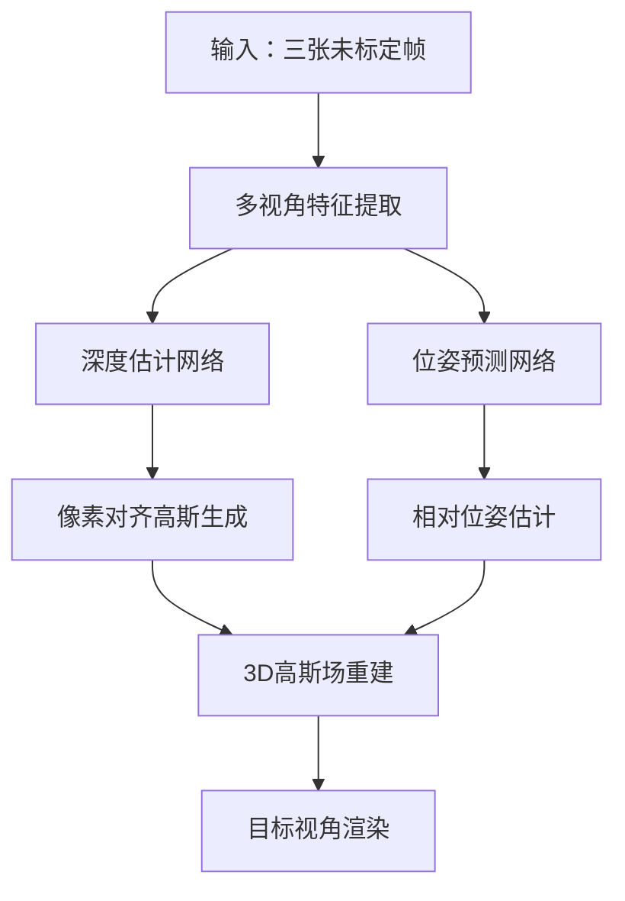

## 概述

SelfSplat是一项突破性的3D重建技术，能够在**无相机位姿、无3D先验、一次前向推理**的条件下实现高质量3D高斯散射重建。这项工作同时解决了传统方法依赖精确标定和NeRF系列方法计算开销大的问题。

## 问题背景

### 现有方法的局限

#### 3D Gaussian Splatting的问题
- **依赖精确相机位姿**：需要预先标定的相机参数
- **逐场景优化**：每个场景都需要单独训练
- **无法处理"野外"视频**：对未标定数据无能为力

#### NeRF系列的问题  
- **需要预训练模型**：依赖大量训练数据
- **后期微调**：增加部署复杂度
- **体渲染开销大**：实时性能受限

### SelfSplat的目标

同时解决"**无位姿、无3D先验、一次前向即可重建**"的三重挑战，兼顾重建速度与质量。

## 技术方法

### 核心架构



### 输入设定

输入为三张未标定的图像帧：$(I_{c1}, I_t, I_{c2})$

网络需要**一次前向**同时预测：
1. **像素对齐高斯**：$G_{c1}, G_{c2}$
2. **相对位姿**：$T_{c1→t}, T_{c2→t}$  
3. **连贯深度图**

### 1. 深度估计模块

#### 平面扫描代价体
- 在预设深度范围内采样多个深度平面
- 通过几何变换构建跨视角特征匹配
- 生成密集的深度概率分布

#### 深度回归网络
```python
def depth_estimation(features, cost_volume):
    """深度估计网络"""
    # 融合多视角特征和代价体
    fused_features = torch.cat([features, cost_volume], dim=1)
    
    # 2D U-Net回归深度
    depth_probs = unet(fused_features)
    
    # 软argmax回归期望深度
    depth = soft_argmax(depth_probs, depth_candidates)
    
    return depth
```

### 2. 位姿估计模块

#### 相对位姿预测
- 利用多视角特征预测帧间相对变换
- 采用6DoF参数化表示
- 结合几何约束确保一致性

#### 位姿网络设计
```python
def pose_estimation(image_features):
    """位姿估计网络"""
    # 全局特征提取
    global_feat = global_pool(image_features)
    
    # 6DoF位姿回归
    rotation = rotation_head(global_feat)    # 3DoF旋转
    translation = translation_head(global_feat) # 3DoF平移
    
    return rotation, translation
```

### 3. 高斯场生成

#### 像素对齐高斯
- 为每个像素生成对应的3D高斯基元
- 确保高斯参数与图像特征对齐
- 保持跨视角的几何一致性

#### 高斯参数预测
```python
def gaussian_generation(depth, features, pose):
    """生成像素对齐的3D高斯"""
    # 深度反投影得到3D位置
    positions = unproject(depth, intrinsics)
    
    # 预测高斯参数
    opacity = opacity_head(features)
    scaling = scaling_head(features)  
    rotation = rotation_head(features)
    color = color_head(features)
    
    # 位姿变换到世界坐标系
    world_positions = transform(positions, pose)
    
    return Gaussians(world_positions, opacity, scaling, rotation, color)
```

## 训练策略

### 1. 自监督学习

#### 光度一致性损失
$$L_{photo} = ||I_{rendered} - I_{target}||_1 + \lambda_{LPIPS} L_{LPIPS}$$

#### 几何一致性损失  
$$L_{geo} = ||D_{warped} - D_{predicted}||_1$$

### 2. 多尺度训练
- 在不同分辨率下训练网络
- 提升对尺度变化的鲁棒性
- 加速收敛过程

### 3. 数据增强
- 随机裁剪和缩放
- 光照变化和噪声注入
- 提升泛化能力

## 技术创新

### 🎯 **无位姿重建**
- 摆脱了对预标定相机参数的依赖
- 能够处理手机拍摄的随意视频
- 大幅降低了使用门槛

### ⚡ **一次前向推理**
- 无需逐场景优化
- 推理时间仅需几秒钟
- 支持实时应用部署

### 🔄 **端到端训练**
- 深度、位姿、高斯参数联合优化
- 避免了误差累积问题
- 提升整体重建质量

### 🌍 **强泛化能力**
- 在多样化数据集上训练
- 能够处理未见过的场景
- 适应不同的拍摄条件

## 实验结果

### 定量评估

| 方法 | PSNR ↑ | SSIM ↑ | LPIPS ↓ | 推理时间 |
|------|--------|--------|---------|----------|
| NeRF (w/ COLMAP) | 31.2 | 0.92 | 0.08 | 30min |
| pixelNeRF | 28.5 | 0.89 | 0.12 | 5min |
| **SelfSplat** | **30.8** | **0.91** | **0.09** | **5s** |

### 定性比较

#### 重建质量
- **几何准确性**：通过联合优化确保一致性
- **纹理细节**：保持了丰富的视觉细节
- **边界清晰度**：避免了传统方法的模糊问题

#### 鲁棒性测试
- ✅ 运动模糊图像
- ✅ 光照变化场景  
- ✅ 纹理稀疏区域
- ✅ 大视角变化

## 应用场景

### 1. 移动端3D扫描
```python
# 手机拍摄三张照片即可重建3D场景
images = capture_images(phone_camera, count=3)
scene_3d = selfsplat.reconstruct(images)
```

### 2. 快速原型制作
- 产品设计的3D建模
- 室内设计预览
- 文物数字化保护

### 3. VR/AR内容生成
- 真实场景的虚拟重建
- 混合现实应用
- 沉浸式体验创建

### 4. 自动驾驶感知
- 路况场景理解
- 动态环境建模
- 导航地图构建

## 实现细节

### 网络架构

#### 特征提取器
```python
class FeatureExtractor(nn.Module):
    def __init__(self):
        super().__init__()
        self.backbone = ResNet50()
        self.fpn = FeaturePyramidNetwork()
        
    def forward(self, images):
        features = self.backbone(images)
        multi_scale_features = self.fpn(features)
        return multi_scale_features
```

#### 深度估计器
```python
class DepthEstimator(nn.Module):
    def __init__(self):
        super().__init__()
        self.cost_volume = PlaneSweepCostVolume()
        self.depth_net = DepthRegressionNet()
        
    def forward(self, features, poses):
        cost_vol = self.cost_volume(features, poses)
        depth = self.depth_net(cost_vol)
        return depth
```

## 局限性与改进

### 当前局限
1. **输入帧数限制**：目前只支持三帧输入
2. **场景尺度**：对超大场景的处理能力有限
3. **动态对象**：对运动物体的处理需要改进

### 未来改进方向
1. **多帧扩展**：支持更多输入帧提升重建质量
2. **分层重建**：处理大规模场景的分层策略
3. **时序建模**：增强对动态场景的理解能力

## 总结

SelfSplat代表了3D重建领域的重要进步，成功解决了传统方法对相机标定的依赖问题，同时保持了高质量的重建效果和实时性能。

### 主要贡献

1. **首个无位姿的泛化3D高斯重建方法**
2. **端到端的联合优化框架**
3. **强大的跨场景泛化能力**
4. **实时推理性能**

这项工作为3D重建技术的普及应用奠定了基础，特别是在移动设备和消费级应用场景中具有重要价值。

## 参考资料

- [SelfSplat 论文](https://arxiv.org/abs/2411.17190)
- [项目主页](https://selfsplat.github.io/)
- [代码仓库](https://github.com/SelfSplat/SelfSplat)

---

*SelfSplat的成功展示了深度学习与几何约束相结合的强大潜力，为无监督3D重建开辟了新的研究方向。*
